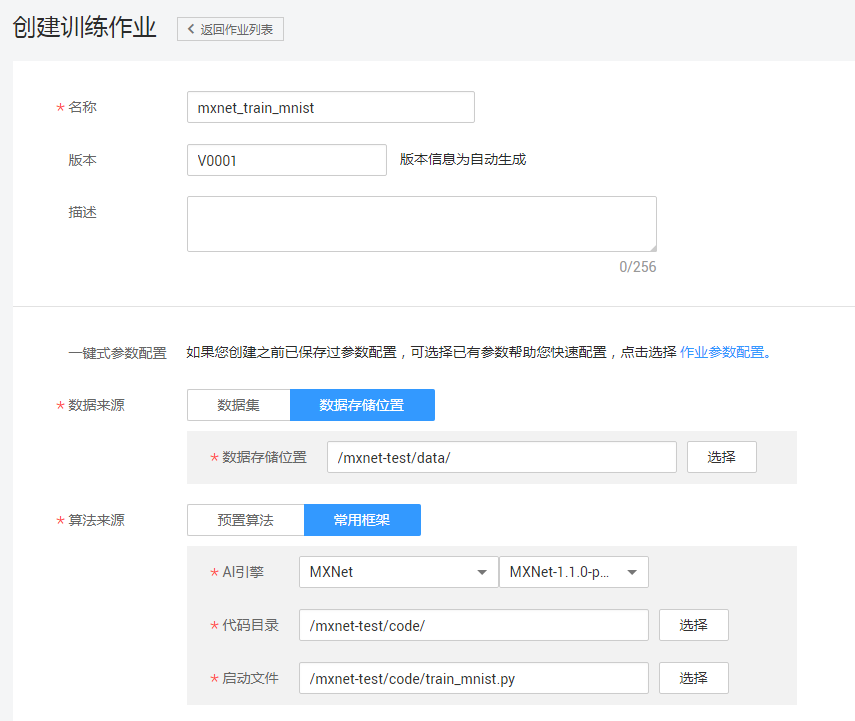
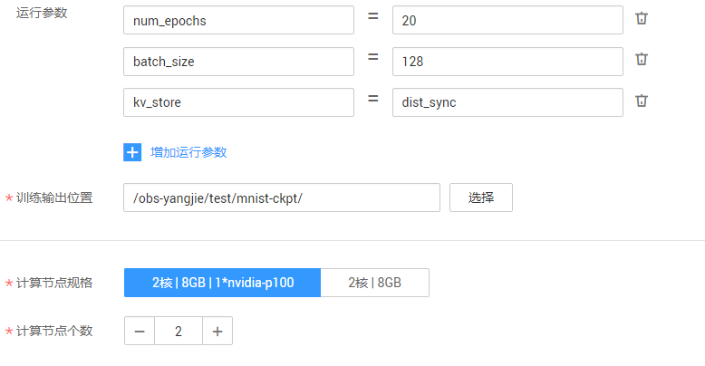
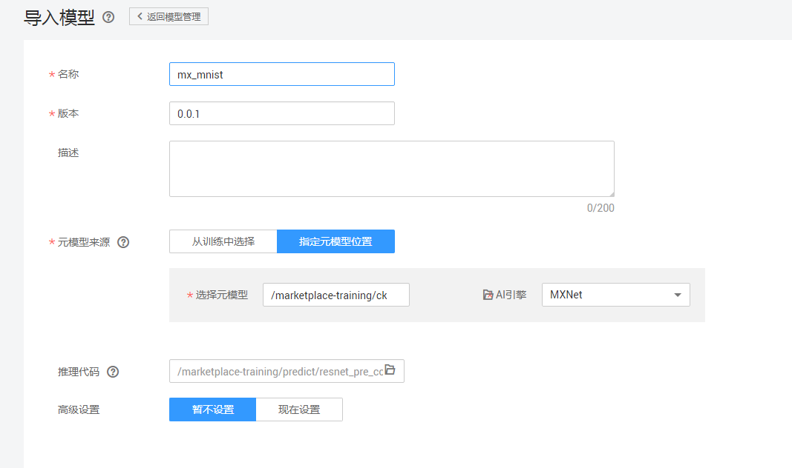
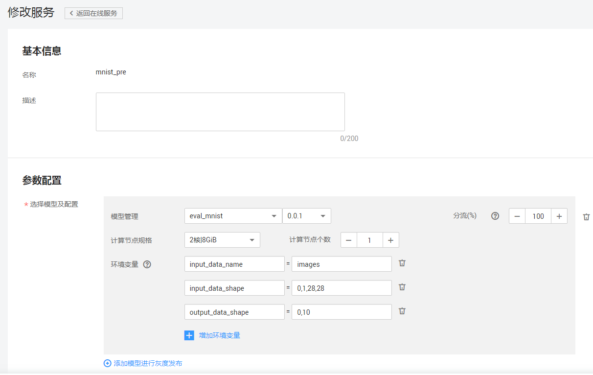

# 使用MXNet实现手写数字图像识别应用

本文介绍在华为云ModelArts平台如何使用MXNet实现MNIST数据集的手写数字图像识别应用。操作的流程分为4部分，分别是：

基本流程包含以下步骤：

1. **准备数据**：下载数据集，解压后上传至OBS桶中。
2. **训练模型**：使用MXNet原生接口编写模型训练脚本，新建训练作业进行模型训练。
3. **部署模型**：得到训练好的模型文件后，新建预测作业将模型部署为在线预测服务。
4. **发起预测请求**：下载并导入客户端工程，发起预测请求获取预测结果。

### 1. 准备数据
下载MNIST数据集，解压缩之后上传至OBS桶中。具体操作如下：

**步骤 1**  &#160; &#160; 下载MNIST数据集。下载路径为：http://data.mxnet.io/data/mnist/ 。数据集文件说明如下：

- t10k-images-idx3-ubyte.gz：验证集，共包含10000个样本。
- t10k-labels-idx1-ubyte.gz：验证集标签，共包含10000个样本的类别标签。
- train-images-idx3-ubyte.gz：训练集，共包含60000个样本。
- train-labels-idx1-ubyte.gz：训练集标签，共包含60000个样本的类别标签。

**步骤 2**  &#160; &#160; 解压缩4个压缩文件，并参考<a href = "https://support.huaweicloud.com/usermanual-dls/dls_01_0040.html">“上传业务数据”</a>章节内容，分别上传至华为云OBS桶 （假设OBS桶路径为：s3://obs-lpf/data/mnist/）。

### 2. 训练模型
接下来，要编写模型训练脚本代码（本案例中已编写好了训练脚本），并完成模型训练，操作步骤如下：

**步骤 1**  &#160; &#160; 下载由MXNet原生接口编写的模型训练脚本文件<a href ="codes/train_mnist.py">train\_mnist.py</a>。

**步骤 2**  &#160; &#160; 参考<a href = "https://support.huaweicloud.com/usermanual-dls/dls_01_0040.html">“上传业务数据”</a>章节内容，将脚本文件上传至华为云OBS桶 （假设OBS桶路径为：s3://obs-lpf/test/mnist/）。

**步骤 3**  &#160; &#160; 登录“ModelArts”管理控制台。

**步骤 4**  &#160; &#160; 在“训练作业”界面，单击左上角的“创建”，参考图1填写训练作业参数。

图1 训练作业参数配置

单计算节点：kv_store设置为‘local’或‘device’

多计算节点：kv_store设置为‘dist_sync’或‘dist_sync_device’

**步骤 5**  &#160; &#160;  参数确认无误后，单击“立即创建”，完成训练作业创建。

训练作业完成后，即完成了模型训练过程。如有问题，可点击作业名称，进入作业详情界面查看训练作业日志信息。

### 3. 部署模型

模型训练完成后，可以创建预测作业，将模型部署为在线预测服务，操作步骤如下：

**步骤 1**  &#160; &#160; 在“模型管理”界面，单击左上角的“导入”，参考图2填写参数。其中，名称可随意填写。[推理代码参考**dls_classification_service.py**](https://github.com/TccccD/modelarts-example/blob/master/Using%20MXNet%20to%20Create%20a%20MNIST%20Dataset%20Recognition%20Application/codes/dls_classification_service.py) 。将推理代码上传到obs，并将其文件路径设置到模型参数配置中的“推理代码”输入框。具体的模型参数如图2。

图2 导入模型参数配置

**步骤 2**  &#160; &#160; 参数确认无误后，单击“立即创建”，完成模型创建。

当模型状态为“正常”时，表示创建成功。单击部署-在线服务，创建预测服务，参考图3填写参数。

图3 部署在线服务参数配置

### 4. 发起预测请求
完成模型部署后，在部署上线-在线服务界面可以看到已上线的预测服务名称，点击进入可以进行在线预测，如图4。

图4 在线服务测试

