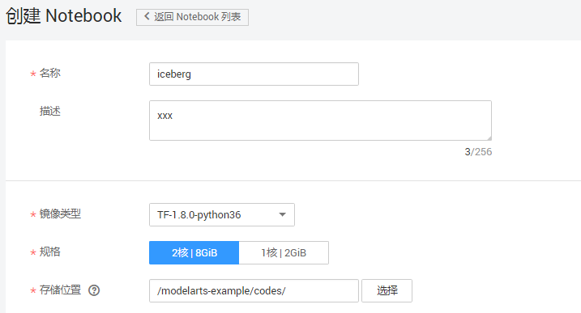
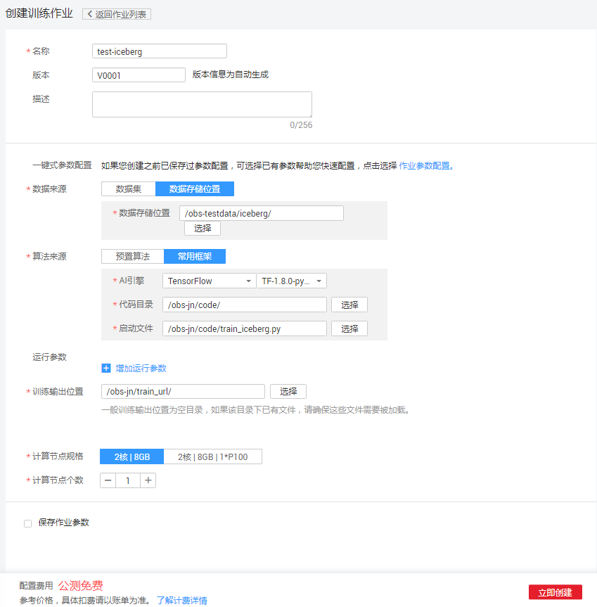
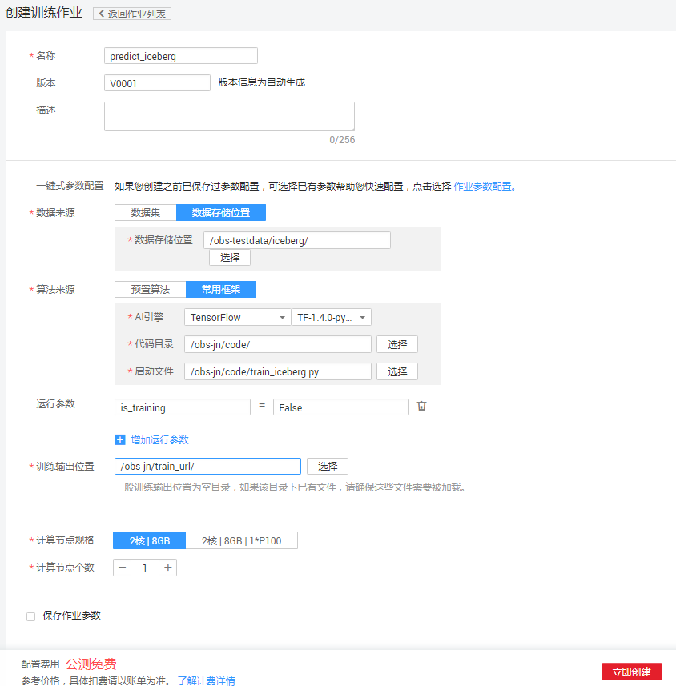

# 使用MoXing实现冰山图像分类应用

本文介绍如何在华为云ModelArts平台上使用MoXing实现Kaggle竞赛中的冰山图像分类任务。实验所使用的图像为雷达图像，需要参赛者利用算法识别出图像中是冰山（iceberg）还是船（ship）。操作的流程分为4部分，分别是：

1.	**准备数据**：下载数据集并上传至华为云OBS桶中，编写代码将数据集格式转换成TFRecord。
3.	**训练模型**：使用MoXing API编写用实现冰山图像分类的网络模型，新建训练作业进行模型训练。
4.	**预测结果**：再次新建训练作业，对test数据集进行预测，并将结果保存到csv文件。
5.	**查看结果**：将预测结果的csv文件提交到Kaggle官网后获取分类结果。
### 1. 准备数据
首先登陆Kaggle官网，下载冰山图像分类数据集并上传至华为云OBS桶中。然后通过华为云ModelArts在线IDE将数据集格式转换成TFRecord格式，操作步骤如下：

**步骤 1**  &#160; &#160; 登录<a href="https://www.kaggle.com/competitions">Kaggle官网</a>，注册并登录账号。

**步骤 2**  &#160; &#160; 选择<a href = "https://www.kaggle.com/c/statoil-iceberg-classifier-challenge">“Statoil/C-CORE Iceberg Classifier Challenge”</a>，进入冰山识别任务简介页面。

**步骤 3**  &#160; &#160; 单击“Data”页签，在文件列表中，单击“Download All”，需按照页面提示，同意规则，并且短信/语音验证通过才能下载（若中国大陆地区手机号是：18688888888，手机号填写格式应为： +86018688888888），将下载后的all.zip文件解压，解压后数据文件包括：

- sample_submission.csv.7z： 提交答案的模板。
- test.json.7z：预测数据集，需要根据该数据集预测出答案，没有分类标签。
- train.json.7z：训练数据集，有分类标签。

**步骤 4**  &#160; &#160; 下载数据集后，解压训练集和预测集，得到train.json和test.json（该格式可以通过pandas.read_json进行读取）。

其中，训练集train.json包含4类数据：band\_1、band\_2、inc\_angle和is_iceberg（测试集），分别是：

- band\_1、band\_2：雷达图像的2个通道，分别是75x75的矩阵。
- inc_angle：雷达图拍摄角度，单位是角度。
- is_iceberg： 标注，冰山为1，船为0。

**步骤 5**  &#160; &#160; 参考<a href="https://support.huaweicloud.com/usermanual-dls/dls_01_0040.html">“上传业务数据”</a>章节内容，将json数据集上传至华为云OBS桶 （假设OBS桶路径为：s3://obs-testdata/iceberg/）。

**步骤 6**  &#160; &#160; 登录“ModelArts”管理控制台，在“全局配置”界面添加访问秘钥。

图1 添加访问秘钥

**步骤 7**  &#160; &#160; 在“开发环境”界面，点击“Notebook”，单击“创建”，在弹出框中填写对应参数，镜像类型请选择TF-1.8.0-python27或者TF-1.8.0-python36。单击“确定”，完成创建操作。

图2 创建Notebook

**步骤 8**  &#160; &#160; 在开发环境列表中，单击所创建开发环境右侧的“打开”，进入Jupyter Notebook文件目录界面。单击右上角的“New”，选择“Python 3” ，进入代码开发界面。

图3 创建Notebook开发界面

**步骤 9**  &#160; &#160; 在Cell中填写数据转换代码，完整代码请参见<a href ="codes/data_format_conversion.py">data\_format\_conversion.py</a>，请根据数据集实际存储位置，修改脚本代码中的BASE_PATH 参数, 即步骤5中上传的train.json和test.json的OBS父目录，在执行数据转换代码前，请先执行以下代码：

	import moxing.tensorflow as mox
	import os
    
	_S3_ACCESS_KEY_ID = os.environ.get('ACCESS_KEY_ID', None)                       
	_S3_SECRET_ACCESS_KEY = os.environ.get('SECRET_ACCESS_KEY', None)
	_endpoint = os.environ.get('ENDPOINT_URL', None)
	_S3_USE_HTTPS = os.environ.get('_S3_ACCESS_KEY_ID', True)
	_S3_VERIFY_SSL = os.environ.get('_S3_SECRET_ACCESS_KEY', False)
	os.environ['AWS_ACCESS_KEY_ID']=_S3_ACCESS_KEY_ID
	os.environ['AWS_SECRET_ACCESS_KEY']=_S3_SECRET_ACCESS_KEY
	os.environ['S3_ENDPOINT']=_endpoint
	os.environ['S3_USE_HTTPS']='1'
	os.environ["S3_VERIFY_SSL"]='0'
	mox.file.set_auth(ak=_S3_ACCESS_KEY_ID,sk=_S3_SECRET_ACCESS_KEY,server=_endpoint,port=None,
	                     is_secure=_S3_USE_HTTPS,ssl_verify=_S3_VERIFY_SSL)

**步骤 10**  &#160; &#160; 单击Cell上方的 ，运行代码（可能需要较长时间，若长时间没有执行结果，请尝试分段执行代码，将脚本分成多段放在不同的cell中执行）。代码运行成功后，将在“s3://obs-testdata/iceberg/”目录下生成如下三个文件：

- iceberg-train-1176.tfrecord：训练数据集
- iceberg-eval-295.tfrecord：验证数据集
- iceberg-test-8424.tfrecord：预测数据集

### 2. 训练模型
将模型训练脚本上传至OBS桶中（您也可以在ModelArts的开发环境中编写模型训练脚本，并转成py文件），然后创建训练作业进行模型训练，操作步骤如下：

**步骤 1**  &#160; &#160; 参考<a href="https://support.huaweicloud.com/usermanual-dls/dls_01_0040.html">“上传业务数据”</a>章节内容，将模型训练脚本文件<a href ="codes/train_iceberg.py">train\_iceberg.py</a>上传至华为云OBS桶 （假设OBS桶路径为：s3://automation/code/）。

**步骤 2**  &#160; &#160; 返回“ModelArts”控制台，在“训练作业”界面。 单击左上角的“创建”。

图4 训练作业界面

**步骤 3**  &#160; &#160; 填写参数。“名称”和“描述”可以随意填写，“数据来源”请选择“数据的存储位置”，“算法来源”请选择“常用框架”，“AI引擎”选择“TensorFlow"，“代码目录”请选择型训练脚本文件train\_iceberg.py所在的OBS父目录，“启动文件”请选择“train\_iceberg.py”，“训练输出位置”请选择一个路径（建议新建一个文件夹）用于保存输出模型和预测文件，参数确认无误后，单击“立即创建”，完成训练作业创建。

图5 训练作业参数配置

**步骤 4**  &#160; &#160; 在模型训练的过程中或者完成后，可以通过创建TensorBoard作业查看一些参数的统计信息，如loss，accuracy等。在“训练作业”界面，点击TensorBoard，再点击“创建”按钮，参数“名称”可随意填写，“日志路径”请选择步骤3中“训练输出位置”参数中的路径。

图6 创建tensorboard

训练作业完成后，即完成了模型训练过程。如有问题，可点击作业名称，进入作业详情界面查看训练作业日志信息。

### 3. 预测结果
待训练作业运行完成后，在“训练输出位置”目录下生成模型文件（如：model.ckpt-5600）。由于我们只需要进行一次预测，因此不需要部署在线预测服务。相关的预测操作已经在“train_iceberg.py”文件写好，预测结果将输出到“submission.csv”文件。我们使用训练作业进行预测，操作步骤如下：

**步骤 1**  &#160; &#160; 参考“2.训练模型”在“训练作业”界面，单击左上角的“创建”。

**步骤 2**  &#160; &#160; 填写参数，参考“2.训练模型 步骤3”填写参数，“训练输出位置”请保持一致，预测‘计算节点个数’只能选择1个节点，另外添加参数“is_training=False”单击“立即创建”，完成训练作业创建。

图7 预测

**步骤 3**  &#160; &#160; 训练作业执行完成后，在“训练作业”界面，单击iceberg_predict作业名称，进入作业的详情界面。在“训练日志”中，可以查看到在eval数据集上的loss值。在“训练输出位置”目录下，能看到用于保存预测结果的“submission.csv”文件。

### 4. 提交预测结果
登录Kaggle官网，将“submission.csv”文件提交到Kaggle上，得到预测结果的准确率（错误率）。
