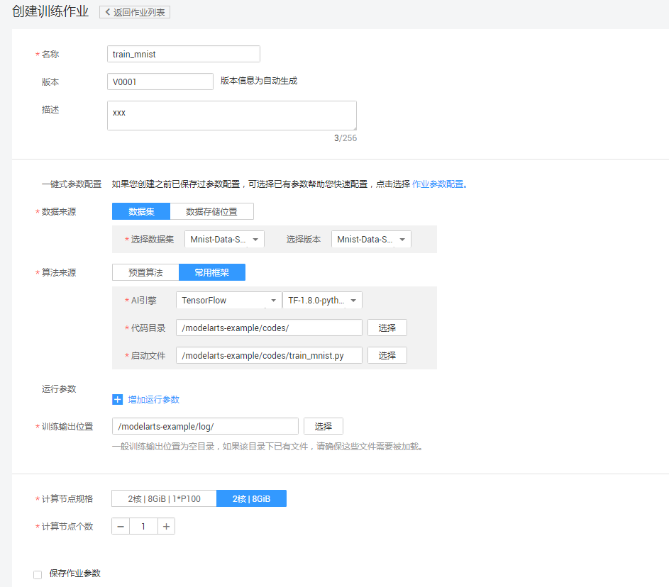
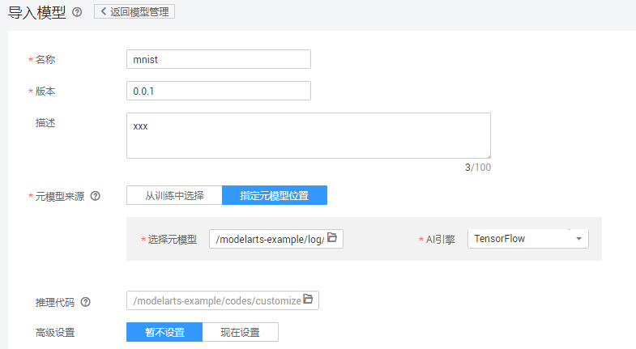

# 使用MoXing实现手写数字图像识别应用

本文介绍在华为云ModelArts平台如何使用MoXing实现MNIST数据集的手写数字图像识别应用。操作的流程分为4部分，分别是：

基本流程包含以下步骤：

1. **准备数据**：下载文本数据集，上传至OBS桶中。
2. **训练模型**：使用MoXing框架编模型训练脚本，新建训练作业进行模型训练。
3. **部署模型**：得到训练好的模型文件后，新建预测作业将模型部署为在线预测服务。
4. **发起预测请求**：下载并导入客户端工程，发起预测请求获取预测结果。

### 1. 准备数据
下载MNIST数据集，解压缩之后上传至OBS桶中。具体操作如下：

**步骤 1**  &#160; &#160; 下载MNIST数据集。下载路径为：[http://data.mxnet.io/data/mnist/](http://data.mxnet.io/data/mnist/) 。 数据集文件说明如下：
- t10k-images-idx3-ubyte.gz：验证集，共包含10000个样本。
- t10k-labels-idx1-ubyte.gz：验证集标签，共包含10000个样本的类别标签。
- train-images-idx3-ubyte.gz：训练集，共包含60000个样本。
- train-labels-idx1-ubyte.gz：训练集标签，共包含60000个样本的类别标签。

**步骤 2**  &#160; &#160; 参考<a href="https://support.huaweicloud.com/usermanual-dls/dls_01_0040.html">“上传业务数据”</a>章节内容，分别上传至华为云OBS桶 （假设OBS桶路径为：s3://obs-testdata/mnist/）。

### 2. 训练模型
接下来，要编写模型训练脚本代码（本案例中已编写好了训练脚本），并完成模型训练，操作步骤如下：

**步骤 1**  &#160; &#160; 下载模型训练脚本文件<a href ="codes/train_mnist.py">train\_mnist.py</a>。参考<a href="https://support.huaweicloud.com/usermanual-dls/dls_01_0040.html">“上传业务数据”</a>章节内容，将脚本文件上传至华为云OBS桶 （假设OBS桶路径为：s3://obs-jn/code/）。

**步骤 2**  &#160; &#160; 登录“ModelArts”管理控制台，在“全局配置”界面添加访问秘钥。如图1。

图1 添加访问秘钥

**步骤 3**  &#160; &#160; 在“训练作业”界面，单击左上角的“创建”, “名称”和“描述”可以随意填写，“数据来源”请选择“数据的存储位置”，“算法来源”请选择“常用框架”，“AI引擎”选择“TensorFlow"，“代码目录”请选择型训练脚本文件train\_mnist.py所在的OBS父目录，“启动文件”请选择“train\_mnist.py”，“训练输出位置”请选择一个路径（建议新建一个文件夹）用于保存输出模型和预测文件，参考图2填写训练作业参数.

图2 训练作业参数配置（训练）

**步骤 4**  &#160; &#160;  参数确认无误后，单击“立即创建”，完成训练作业创建。

**步骤 5**  &#160; &#160; 在模型训练的过程中或者完成后，通过创建TensorBoard作业查看一些参数的统计信息，如loss， accuracy等。在“训练作业”界面，点击TensorBoard，再点击“创建”按钮，参数“名称”可随意填写，“日志路径”请选择步骤3中“训练输出位置”参数中的路径。如图3。

图3 创建tensorboard

训练作业完成后，即完成了模型训练过程。如有问题，可点击作业名称，进入作业详情界面查看训练作业日志信息。

### 3. 部署模型

模型训练完成后，可以创建预测作业，将模型部署为在线预测服务，操作步骤如下：

**步骤 1**  &#160; &#160; 在“模型管理”界面，单击左上角的“导入”，参考图2填写参数。名称可随意填写，“元模型来源”选择“指定元模型位置”，“选择元模型”的路径与训练模型中“训练输出位置”保持一致，“AI引擎”选择“TensorFlow”。推理代码参考codes/predict.py 。

图4 导入模型参数配置

**步骤 2**  &#160; &#160; 参数确认无误后，单击“立即创建”，完成模型创建。

当模型状态为“正常”时，表示创建成功。单击部署-在线服务，创建预测服务，参考图5填写参数。

图5 部署在线服务参数配置

### 4. 发起预测请求

完成模型部署后，在部署上线-在线服务界面可以看到已上线的预测服务名称，点击进入可以进行在线预测,如图6。

图6 在线服务测试

