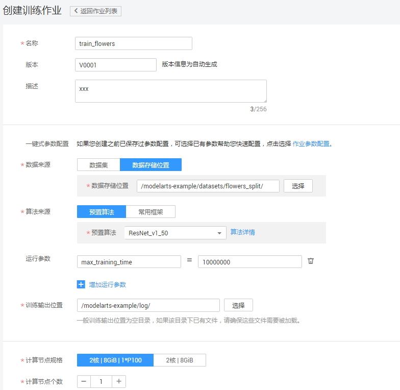
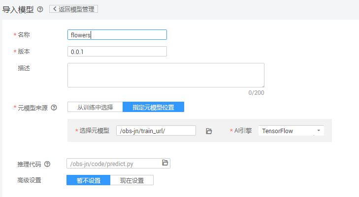
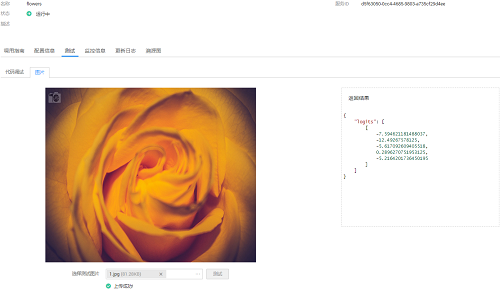

# 使用预置模型实现花卉图像分类应用

本文介绍在华为云ModelArts平台如何使用flowers数据集对预置的ResNet_v1\_50模型进行重训练，快速构建花卉图像分类应用。操作步骤分为4部分，分别是：

1.	**准备数据**：下载flowers数据集，并上传至华为云对象存储服务器（OBS）中。
2.	**训练模型**：使用flowers训练集，对ResNet_v1\_50模型重训练，得到新模型。
3.	**部署模型**：将得到的模型，部署为在线预测服务。
4.	**发起预测请求**：发起预测请求获取请求结果。
### 1. 准备数据
下载flowers数据集并上传至华为云对象存储服务器（OBS）桶中，操作步骤如下：

**步骤 1** &#160; &#160; 下载并解压缩数据集压缩包“flower_photos.tgz”，flowers数据集的下载路径为：[https://dls-public-data.obs.cn-north-1.myhwclouds.com/tensorflow/modelarts_flowers.zip](https://dls-public-data.obs.cn-north-1.myhwclouds.com/tensorflow/modelarts_flowers.zip)

**步骤 2**&#160; &#160; 参考<a href="https://support.huaweicloud.com/usermanual-dls/dls_01_0040.html">“上传业务数据”</a>章节内容，将数据集上传至华为云OBS桶中（假设OBS桶路径为：s3://modelarts-example/datasets/flowers_split）。

该路径下包含了用户训练模型需要使用的所有图像文件， 该目录下有5种类别，分别为：daisy, dandelion, roses, sunflowers, tulips。目录结构为：

    s3://obs-testdata/flowers_split
	    
       |- 01.jpg
       |- 01.txt
       |- ...
	   
       |- n.jpg
       |- n.txt
       |- ...
	    

**步骤 3**  &#160; &#160; 登录[“ModelArts”](https://console.huaweicloud.com/modelarts/?region=cn-north-1#/manage/dashboard)管理控制台，在“全局配置”界面添加访问秘钥。如图1。

图1 添加访问秘钥

### 2. 训练模型
接下来将使用训练集对预置的ResNet_v1\_50模型进行重训练获取新的模型，操作步骤如下：

**步骤 1**&#160; &#160; 返回“ModelArts”管理控制台界面。单击左侧导航栏的“训练作业”，进入“训练作业”界面。

**步骤 2**&#160; &#160;填写参数。“名称”和“描述”可以随意填写，“数据来源”请选择“数据的存储位置”(s3://modelarts-example/datasets/flowers\_split)，即数据所在的父目录，在“算法/预置算法”列表中找到名称为“ResNet_v1\_50”的模型，因运行时间可能较长，“运行参数”点击增加运行参数，增加	
max\_training\_time=10000000，“训练输出位置”请选择一个路径（s3://modelarts-example/log）用于保存输出模型和预测文件，参数确认无误后，单击“立即创建”完成训练作业创建。

图2 训练作业的参数配置

"数据集"请选择训练集和验证集所在的父目录（在本案例中，即s3://modelarts-example/datasets/flowers\_split）。

**步骤 3**&#160; &#160; 在模型训练的过程中或者完成后，通过创建TensorBoard作业查看一些参数的统计信息，如loss， accuracy等。在“训练作业”界面，点击TensorBoard，再点击“创建”按钮，参数“名称”可随意填写，“日志路径”请选择步骤3中“训练输出位置”参数中的路径(s3://modelarts-example/log)。

图3 创建tensorboard

训练作业完成后，即完成了模型训练过程。如有问题，可点击作业名称，进入作业详情界面查看训练作业日志信息。

**步骤 4**&#160; &#160; 当训练作业运行成功后，可以在创建训练作业选择的训练输出位置OBS路径下看到新的模型文件。

### 3. 部署模型

模型训练完成后，可以创建预测作业，将模型部署为在线预测服务，操作步骤如下：

**步骤 1**  &#160; &#160; 在“模型管理”界面，单击左上角的“导入”，参考图2填写参数。名称可随意填写，“元模型来源”选择“指定元模型位置”，“选择元模型”的路径与训练模型中“训练输出位置”保持一致(s3://modelarts-example/log)，“AI引擎”选择“TensorFlow”，“推理代码”可忽略。

图4 导入模型参数配置

**步骤 2**  &#160; &#160; 参数确认无误后，单击“立即创建”，完成模型创建。当模型状态为“正常”时，表示创建成功。单击部署-在线服务，创建预测服务，参考图5填写参数。

当模型状态为“正常”时，表示创建成功。单击部署-在线服务，创建预测服务。

图5 部署在线服务参数配置

### 4. 发起预测请求

完成模型部署后，在部署上线-在线服务界面可以看到已上线的预测服务名称，点击进入可以进行在线预测，如图8。

图6 在线服务测试

